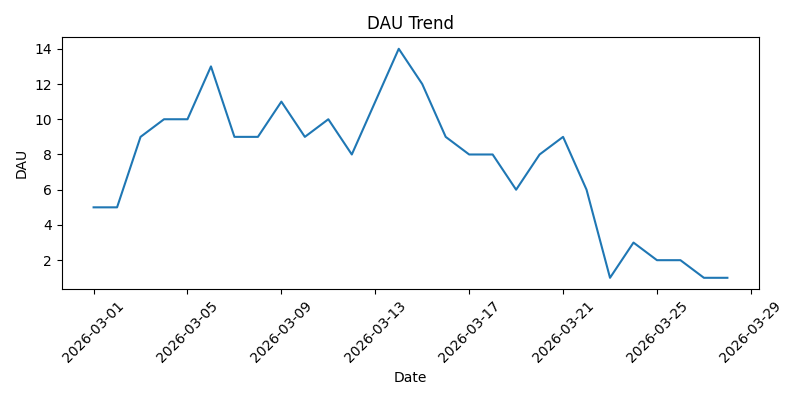
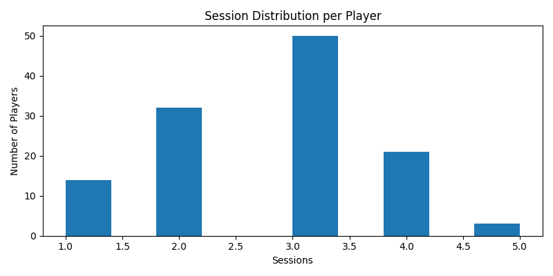

# Player Retention Analytics

A game analytics project that simulates player event data and analyzes core engagement metrics such as DAU, retention, funnel conversion, and session depth.

## Project Overview

This project demonstrates an end-to-end game data analytics workflow using SQL and Python.

It includes:
- designing a player event schema
- generating a simulated dataset
- computing key game KPIs (DAU, retention, funnel)
- visualizing player engagement patterns

The goal is to replicate how game data teams analyze player behavior and identify retention opportunities.

---

## Dataset

The dataset simulates player-level telemetry data with the following fields:

- `player_id`
- `install_date`
- `event_time`
- `platform`
- `country`
- `acquisition_source`
- `event_name`
- `session_id`
- `level_num`
- `session_length_sec`

### Event Types
- `install`
- `session_start`

This structure supports:
- cohort-based retention analysis
- engagement tracking
- funnel analysis

---

## Key Metrics

### Daily Active Users (DAU)
Number of distinct active players per day.

### D1 Retention
Percentage of players who return 1 day after install.

### D7 Retention
Percentage of players who return 7 days after install.

### Funnel
Install → Session Start → D1 Retained

### Session Depth
Distribution of session counts per player.

---

## Example Insights

From the analysis:

- **DAU shows an initial increase followed by a gradual decline**, which is typical when retention is not strong enough to sustain growth  
- **D1 retention is moderate (~30–60%)**, indicating partial success in onboarding but noticeable early churn  
- **D7 retention drops significantly**, suggesting weak mid-term engagement and lack of long-term retention drivers  
- **Session distribution shows most players have 2–3 sessions**, while a small group demonstrates higher engagement  

### Interpretation

These patterns suggest:
- improving onboarding experience can increase D1 retention  
- adding progression systems or incentives may improve D7 retention  
- targeting highly engaged players could drive deeper engagement  

---

## Tools Used

- **SQL** — KPI computation and cohort analysis  
- **Python** — data processing and visualization  
- **DuckDB** — SQL engine on local data  
- **Pandas** — data manipulation  
- **Matplotlib** — visualization  

---

## Visualizations

### DAU Trend


### Session Distribution


---

## How to Run

```bash
pip install -r requirements.txt
python src/main.py
```

## Project Structure
```text
player-retention-analytics/
│
├─ data/
│  └─ player_events_mock.csv
├─ notebooks/
│  └─ retention_analysis.ipynb
├─ sql/
│  └─ retention_queries.sql
├─ src/
│  └─ main.py
├─ visuals/
│  ├─ dau_trend.png
│  └─ session_distribution.png
├─ README.md
└─ requirements.txt
```